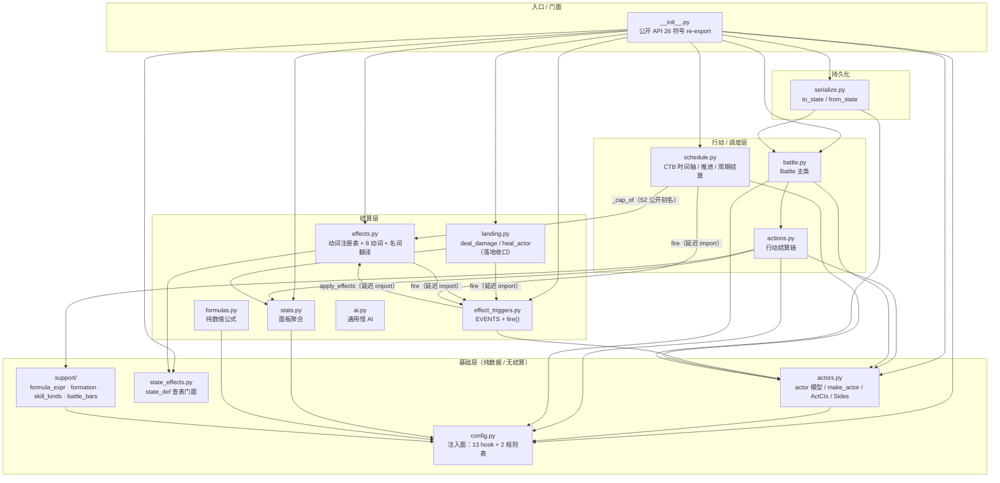

# 架构总览

## 一句话

14 个引擎模块 + 4 个通用件；**依赖方向严格单向**：`support` ← 基础层 ← 结算层 ← 调度层。
没有循环依赖，没有「引擎→内容」边（门禁 `tests/test_engine_no_content.py` 机器验证）。

## 模块依赖图



图例：实线 = 模块级 import；`（延迟 import）` = 函数内 import，用来打断环。

**实测的 import 拓扑**（AST 扫描 `game/battle2/**`，本次文档编写期）：

- **模块级（top-level）import 是一个 DAG** —— 无模块级环。唯一两条模块级内部边是
  `schedule → actors, effects` 与 `battle → actors`。
- **函数内 import 制造了恰好 2 对双向互指**：`effects ↔ effect_triggers`
  （`effects.py:348` / `effect_triggers.py:95`）与 `battle ↔ serialize`
  （`battle.py:568` / `serialize.py:61`）。这两对都是「延迟 import 破环」的写法，
  **改它们的时候不要把 import 提到模块级**。
- `support/*` 只 import 上级包（`from .. import config`），不 import 任何兄弟结算模块 ——
  它是可单独复制的纯函数库。

## 三层职责

### 基础层 — 只存数据、只算纯函数

| 模块 | 它不知道什么 | 它知道什么 |
|---|---|---|
| `actors.py` | 任何人都一样（无类型分派） | dict 字段名、`ct` 是绝对时刻 |
| `config.py` | 表里有什么 | 表叫什么名字（13 个 hook 名 + 2 个表名） |
| `state_effects.py` | 规则语义 | 「去哪查规则」 |
| `support/` | 你的游戏 | 站位/射程数学、表达式求值、条的算术 |

### 结算层 — 「发生什么」

- `effects.py`：**动词执行器**。所有状态写入都从这里过（`actor.effects[key]`）
- `landing.py`：**伤害/治疗的唯一物理层**。护盾吸收、扣血、死亡判定只在这里
- `effect_triggers.py`：**事件分发**。它不认识任何效果内容，只做「主体过滤 + 遍历 triggers」
- `stats.py`：**面板聚合**。伤害/速度/暴击都得先问它
- `formulas.py`：**纯公式**（引擎自带一份，但完全依赖 config 的参数表）
- `ai.py`：**通用决策**（条件优先级表 / 权重），谓词只做数字比较

### 行动/调度层 — 「谁在什么时候做什么」

- `actions.py`：一次行动的完整结算链（校验 → 扣费 → 冷却 → 分派 → 伤害段 → 落地 → 事件）
- `schedule.py`：**时钟**。推进、到期、周期结算、人控/自动的决策点仲裁
- `battle.py`：**门面**。构造、行动入口、胜负判定、运行期加人

关键分工：**`actions` 负责「这次行动发生了什么」，`schedule` 负责「现在是什么时候、
该谁动」。** 两者不互相调用 —— 都由 `battle.py` 串起来。

## 一次战斗的模块协作

```
                        ┌──────────────┐
   you (命令层)  ──────→│  Battle       │
                        │  .human_act   │
                        └──────┬───────┘
                               ↓ ctx（谁/打谁/用什么）
                        ┌──────────────┐
                        │  actions      │  ← stats（面板）· config.formulas（数值）
                        └──────┬───────┘
                               ↓ 计划伤害
                        ┌──────────────┐        ┌──────────────┐
                        │  landing      │───────→│ effect_triggers│ fire(事件)
                        │  （落地）      │        └──────┬───────┘
                        └──────┬───────┘                   ↓ 匹配 actor.triggers
                               ↓ 扣血/死亡          ┌──────────────┐
                        ┌──────────────┐           │  effects      │ 动词执行器
                        │  Battle       │           └──────┬───────┘
                        │  ._check_side │                  ↓ 写 actor.effects
                        └──────────────┘           （下一轮 stats 折算时生效）
                               ↑
                        ┌──────────────┐
                        │  schedule     │  推进时钟 → 到期/周期结算 → time_advance
                        └──────────────┘
```

**闭环点**：`effects` 写进 `actor.effects` 后，**不在写入时立即生效**——
它要等下一次 `stats.actor_stats()` 被调用（通常是下一次伤害/治疗计算）才折算进面板。
这解释了一个常见困惑：「我加了 buff，为什么这一击的伤害没变？」
答：buff 快照要经过 `stats` 才成为面板值。

## 分层带来的三条硬规则

1. **落地只能走 `landing`**。任何模块自己扣 `hp` 都会绕过护盾/死亡/事件。
   （例：`schedule` 的 DOT 结算也调 `landing.deal_damage`，`schedule.py:292`）
2. **状态只能写 `effects`**（护盾/冷却除外，它们各有独立容器与消费点）。
   写别的地方 = `stats`/`schedule`/`cleanse` 都看不见它。
3. **引擎不 import 内容**。需要数值就读 hook、需要行为就读声明。

## 想深入

- 逐函数调用链（带行号） → [data-flow.md](data-flow.md)
- 为什么长成这样（ADR） → [design-decisions.md](design-decisions.md)
- 与内容层的物理边界 → [boundaries.md](boundaries.md)
