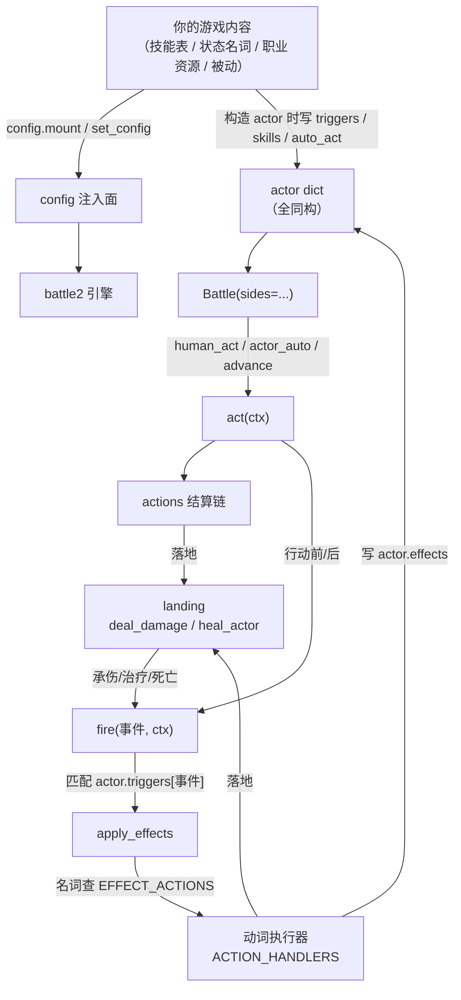

# 概念地图

这一层解释**为什么**引擎长成这样。想查签名请去 [reference/](../reference/api.md)；
想完成任务请去 [guides/](../guides/write-a-mechanic.md)。两处不重复写同一件事。

## 一张图看懂整套模型

三个关键点：

1. **数据只有一个方向**：内容 → 引擎。引擎通过 `config` 读表、通过 `actor` 读状态，
   从不反过来 import 你的游戏（门禁：`tests/test_engine_no_content.py`）。
2. **`triggers` 是「事件 → 效果声明」的挂点**，`effects` 是「状态」的家。
   两容器职责不重叠：`triggers` 描述**何时做**，`effects` 保存**已经存在的状态**。
3. **一切落血都过 `landing`**。这是唯一收口点，绕过它就会丢护盾/死亡判定。

## 各页导读

| 页面 | 一句话 | 什么时候读 |
|---|---|---|
| [actor-model.md](actor-model.md) | 玩家/怪/召唤物是同一个 dict；字段全集与三个扩展区 | 你要往 actor 上挂自定义状态时 |
| [event-bus.md](event-bus.md) | `fire()` 的匹配/过滤/注入语义，ctx 约定 | 你写的东西「该在什么时候触发」 |
| [declaration-tables.md](declaration-tables.md) | 为什么不写代码而写声明（四条表各自解决什么） | 你准备写 `if 职业 == ...` 之前 |
| [effects.md](effects.md) | `effects[key] = {...}` 的条目形态与「声明决定行为」 | 你要让引擎"认识"一个新状态 |
| [ctb-schedule.md](ctb-schedule.md) | 绝对时刻制、行动耗时公式、周期结算 | 你要做速度/加速/减速/持续伤害 |
| [config-injection.md](config-injection.md) | 13 个 hook、`strict` 两档、未装配的三种后果 | 你第一次接引擎 / 排查"没生效" |

## 三条贯穿全书的设计公理

写这套引擎的人反复用同三句话决策。遇到设计问题，先按它们推一遍：

1. **零游戏知识**：引擎里不出现任何具体名词、职业 id、数值常量。
   需要时改成「读声明」或「问 hook」。
2. **零默认值**：没声明 = 没行为。引擎宁可什么都不做，也不替你猜一个合理值。
   （例外见 [actor-model.md](actor-model.md) 的 `crit` 兜底 0.05 —— 唯一的数值兜底。）
3. **actor 同构**：不为「玩家」「Boss」「召唤物」写分支代码。
   若某个机制只对某类单位生效，那是**数据字段**（`is_boss` / `role`），不是类型。

## 缺口的读法

本 wiki 里带 ⚠️ 的地方是**当前代码里没有消费方**的声明或字段。
它们是真实存在的历史遗留，不是笔误；总表在 [_selfcheck.md](../_selfcheck.md)。
